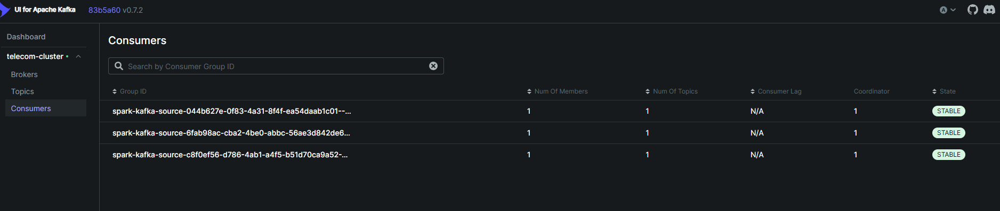
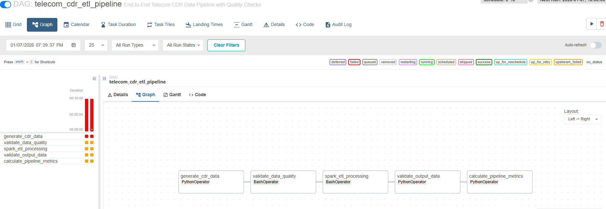
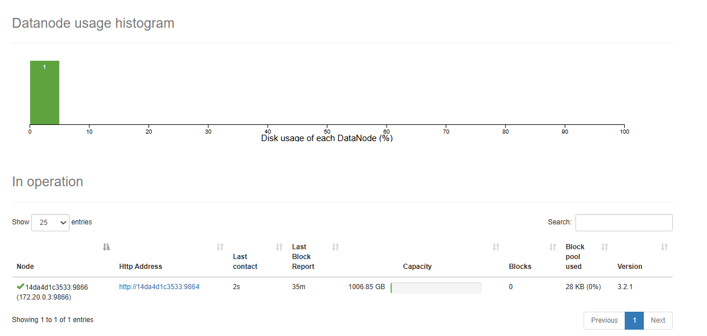
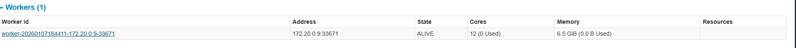
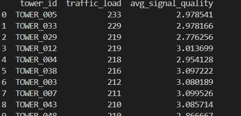

# Telecom Data Pipeline: Technical Documentation

## Table of Contents
1. [System Overview](#system-overview)
2. [Architecture](#architecture)
3. [Technology Stack](#technology-stack)
4. [Data Management Strategy](#data-management-strategy)
5. [Framework Analysis](#framework-analysis)
6. [Implementation Results](#implementation-results)
7. [Issues and Limitations](#issues-and-limitations)
8. [Next Steps](#next-steps)

---

## System Overview

This project implements a production-grade data pipeline for processing telecom call detail records (CDR). The system handles both historical batch data and real-time streaming events through a multi-layer architecture.

### Primary Objectives

1. Process large volumes of telecom CDR data efficiently
2. Ensure data quality before processing
3. Support both batch and real-time analytics
4. Automate workflow orchestration
5. Provide monitoring and observability

### System Capabilities

**Batch Processing:**
- Generates 5,000 CDR records per execution
- Validates data quality with 7 automated checks
- Processes aggregations for billing and network analytics
- Outputs results in compressed Parquet format

**Streaming Processing:**
- Ingests real-time call events at 10 events/second
- Processes data in 5-minute tumbling windows
- Maintains exactly-once semantics with checkpointing
- Supports 10-minute watermarking for late data

**Orchestration:**
- Automated workflow execution every 6 hours
- 5-task DAG with dependency management
- Automatic retry on failure (2 attempts)
- Centralized monitoring and logging

---

## Architecture

### System Architecture Diagram

```
┌─────────────────────────────────────────────────────────────────────────────┐
│                         TELECOM DATA PIPELINE                                │
│                    (Production-Grade Architecture)                           │
└─────────────────────────────────────────────────────────────────────────────┘

┌─────────────────────────────────────────────────────────────────────────────┐
│  LAYER 1: DATA INGESTION                                                    │
├─────────────────────────────────────────────────────────────────────────────┤
│                                                                              │
│  ┌──────────────────┐              ┌────────────────────┐                  │
│  │  Batch Generator │              │  Streaming Source  │                  │
│  │   (generator.py) │              │ (streaming_prod.py)│                  │
│  │                  │              │                    │                  │
│  │  • 5K records    │              │  • 10 events/sec   │                  │
│  │  • CSV format    │              │  • JSON events     │                  │
│  └────────┬─────────┘              └─────────┬──────────┘                  │
│           │                                   │                             │
│           ▼                                   ▼                             │
│  ┌─────────────────┐               ┌──────────────────┐                    │
│  │   data/raw/     │               │  Kafka Broker    │                    │
│  │ cdr_*.csv files │               │  Topic: cdr-evt  │                    │
│  └────────┬────────┘               └─────────┬────────┘                    │
└───────────┼──────────────────────────────────┼──────────────────────────────┘
            │                                   │
┌───────────▼───────────────────────────────────▼──────────────────────────────┐
│  LAYER 2: DATA QUALITY                                                       │
├──────────────────────────────────────────────────────────────────────────────┤
│                                                                              │
│  ┌────────────────────────────────────────────────┐                         │
│  │     Data Quality Validator                     │                         │
│  │     (data_quality_validator.py)                │                         │
│  ├────────────────────────────────────────────────┤                         │
│  │  Schema validation                             │                         │
│  │  NULL checks                                   │                         │
│  │  Uniqueness constraints                        │                         │
│  │  Format validation (phone numbers)             │                         │
│  │  Enum validation (call types)                  │                         │
│  │  Range checks (duration, signal)               │                         │
│  │  Business rules                                │                         │
│  └──────────────────┬─────────────────────────────┘                         │
│                     │                                                        │
│         ┌───────────▼──────────┐                                            │
│         │  QUALITY GATE        │                                            │
│         │  Pass → Continue     │                                            │
│         │  Fail → Block        │                                            │
│         └───────────┬──────────┘                                            │
└─────────────────────┼──────────────────────────────────────────────────────┘
                      │
┌─────────────────────▼──────────────────────────────────────────────────────┐
│  LAYER 3: PROCESSING                                                        │
├─────────────────────────────────────────────────────────────────────────────┤
│                                                                              │
│  ┌──────────────────────────────┐    ┌───────────────────────────────┐     │
│  │  Spark Batch Processing      │    │  Spark Streaming Processing   │     │
│  │  (process_cdr.py)            │    │  (streaming_consumer.py)      │     │
│  ├──────────────────────────────┤    ├───────────────────────────────┤     │
│  │                              │    │                               │     │
│  │  Job A: Billing Analytics    │    │  Window: 5 min tumbling       │     │
│  │  • Group by caller           │    │  Watermark: 10 min            │     │
│  │  • Sum duration              │    │                               │     │
│  │  • Count calls               │    │  • Real-time billing          │     │
│  │  • Calc billable mins        │    │  • Tower metrics              │     │
│  │                              │    │  • Checkpointing              │     │
│  │  Job B: Network Health       │    │                               │     │
│  │  • Group by tower            │    │  Output Mode: Append          │     │
│  │  • Count traffic load        │    │  Trigger: 30 sec              │     │
│  │  • Avg signal quality        │    │                               │     │
│  │                              │    │                               │     │
│  └──────────────┬───────────────┘    └──────────────┬────────────────┘     │
│                 │                                    │                      │
└─────────────────┼────────────────────────────────────┼─────────────────────┘
                  │                                    │
┌─────────────────▼────────────────────────────────────▼─────────────────────┐
│  LAYER 4: STORAGE                                                           │
├─────────────────────────────────────────────────────────────────────────────┤
│                                                                              │
│  ┌──────────────────────┐         ┌──────────────────────┐                 │
│  │  Hadoop HDFS         │         │  Parquet Files       │                 │
│  │  (Distributed FS)    │         │  (Columnar Storage)  │                 │
│  ├──────────────────────┤         ├──────────────────────┤                 │
│  │                      │         │                      │                 │
│  │  • Fault tolerance   │         │  • Compressed        │                 │
│  │  • Replication: 1    │         │  • Schema evolution  │                 │
│  │  • Block size: 128MB │         │  • Fast queries      │                 │
│  │                      │         │  • Type-safe         │                 │
│  └──────────────────────┘         └──────────────────────┘                 │
│                                                                              │
│  data/processed/billing_report/    (Batch output)                           │
│  data/processed/network_health/    (Batch output)                           │
│  data/streaming/billing_realtime/  (Stream output)                          │
│  data/streaming/network_realtime/  (Stream output)                          │
│                                                                              │
└─────────────────────────────────────────────────────────────────────────────┘

┌─────────────────────────────────────────────────────────────────────────────┐
│  LAYER 5: ORCHESTRATION & MONITORING                                        │
├─────────────────────────────────────────────────────────────────────────────┤
│                                                                              │
│  Apache Airflow (telecom_etl_dag.py)                                        │
│                                                                              │
│  [Generate] → [Validate] → [Process] → [Verify] → [Metrics]                │
│                                                                              │
│  Schedule: Every 6 hours | Retry: 2 attempts with 5-min delay               │
│                                                                              │
│  Web Interfaces:                                                            │
│  • Airflow UI (8088)  - Workflow monitoring                                 │
│  • Spark UI (8080)    - Job execution                                       │
│  • Kafka UI (8082)    - Stream monitoring                                   │
│  • Hadoop UI (9870)   - Storage browser                                     │
│                                                                              │
└─────────────────────────────────────────────────────────────────────────────┘
```

### Data Flow: Batch Pipeline

```
CSV Files → Quality Validation → Spark ETL → Parquet Output
    ↓              ↓                  ↓            ↓
data/raw/    7 checks pass      Aggregations   Billing Report
                                                Network Health
```

### Data Flow: Streaming Pipeline

```
Event Source → Kafka Broker → Spark Streaming → Parquet Output
     ↓              ↓               ↓                 ↓
10 events/sec   Buffer &       5-min windows    Real-time metrics
               Distribute
```

### Infrastructure Components

| Component | Container | Purpose | Port |
|-----------|-----------|---------|------|
| Hadoop NameNode | namenode | Metadata management | 9870 |
| Hadoop DataNode | datanode | Block storage | 9864 |
| Spark Master | spark-master | Cluster manager | 8080 |
| Spark Worker | spark-worker-1 | Executor node | 8081 |
| Kafka Broker | kafka | Message queue | 9092 |
| Zookeeper | zookeeper | Kafka coordination | 2181 |
| Kafka UI | kafka-ui | Stream monitoring | 8082 |
| Airflow Webserver | airflow-webserver | Workflow UI | 8088 |
| Airflow Scheduler | airflow-scheduler | DAG execution | - |
| PostgreSQL | postgres | Airflow metadata | 5432 |

**Total Containers:** 10  
**Network:** Docker bridge (telecom_network)  
**Orchestration:** Docker Compose 3.8

---

## Technology Stack

### Framework Comparison

| Framework | Version | Role | Alternative | Selection Rationale |
|-----------|---------|------|-------------|---------------------|
| Apache Spark | 3.0.0 | Distributed processing | Apache Flink, Dask | Industry standard, mature ecosystem |
| Apache Kafka | 7.4.0 | Message broker | RabbitMQ, Pulsar | High throughput, horizontal scaling |
| Apache Airflow | 2.7.3 | Workflow orchestration | Luigi, Prefect | Python-native, extensive operators |
| Hadoop HDFS | 3.2.1 | Distributed storage | MinIO, Ceph | Spark integration, proven reliability |
| Docker Compose | 3.8 | Container orchestration | Kubernetes | Lightweight, development-friendly |

### Supporting Libraries

| Library | Version | Purpose |
|---------|---------|---------|
| Pandas | 2.0.3 | Data manipulation |
| PyArrow | 14.0.1 | Parquet I/O |
| Faker | 19.3.0 | Data generation |
| kafka-python | 2.0.2 | Kafka client |

---

## Data Management Strategy

### Data Quality Framework

The pipeline implements automated quality gates to prevent bad data from contaminating downstream systems.

**Validation Checks:**

1. **Schema Validation**
   - Ensures all required columns exist
   - Prevents processing incomplete data
   - Blocks execution on missing fields

2. **NULL Detection**
   - Identifies missing values in critical fields
   - Reports percentage of NULL records
   - Enforces completeness requirements

3. **Uniqueness Constraints**
   - Validates call_id uniqueness
   - Detects duplicate records
   - Maintains referential integrity

4. **Format Validation**
   - Phone numbers: +947XXXXXXXX (Sri Lankan format)
   - Timestamp: ISO 8601 format
   - Prevents malformed data propagation

5. **Enumeration Validation**
   - call_type: [VOICE, SMS, DATA]
   - Rejects invalid categories
   - Ensures consistent classifications

6. **Range Validation**
   - duration_sec: 0-7200 (max 2 hours)
   - signal_strength: 1-5 (quality scale)
   - Catches outliers and data errors

7. **Business Rules**
   - SMS/DATA calls have 0 duration
   - All calls must have tower_id
   - Timestamps must be sequential

**Quality Gate Behavior:**
- Pass: Proceed to processing
- Fail: Block pipeline, generate error report, alert operators

### Data Storage Strategy

**File Formats:**

| Format | Use Case | Advantages | Compression |
|--------|----------|------------|-------------|
| CSV | Raw ingestion | Human-readable, universal | None |
| Parquet | Processed output | Columnar, compressed, schema-aware | Snappy |
| JSON | Streaming events | Self-describing, flexible | None |

**Parquet Benefits:**
- 80% compression ratio vs CSV
- Predicate pushdown for queries
- Schema evolution support
- Type safety enforcement
- Fast columnar scans

**Directory Structure:**

```
data/
├── raw/                        # Ingestion layer
│   └── cdr_YYYYMMDD_HHMMSS.csv
├── processed/                  # Batch outputs
│   ├── billing_report/
│   │   ├── part-00000.parquet
│   │   └── _SUCCESS
│   └── network_health/
│       ├── part-00000.parquet
│       └── _SUCCESS
├── streaming/                  # Real-time outputs
│   ├── billing_realtime/
│   └── network_realtime/
└── quality_reports/            # Validation logs
    └── validation_report_*.txt
```

### Batch vs Streaming Strategy

**When to Use Batch:**
- Historical analysis (monthly reports)
- Complete dataset required
- Resource optimization (off-peak processing)
- Complex multi-stage transformations
- Compliance reporting

**When to Use Streaming:**
- Real-time alerting (fraud detection)
- Live dashboards
- Immediate response required
- Event-driven actions
- Continuous metrics

**Implementation Differences:**

| Aspect | Batch | Streaming |
|--------|-------|-----------|
| Latency | Minutes to hours | Seconds |
| Data Volume | Complete dataset | Incremental |
| Resource Usage | Periodic spikes | Continuous baseline |
| Complexity | Simple aggregations | Windowing, watermarks |
| Fault Tolerance | Restart job | Checkpointing |

---

## Framework Analysis

### Apache Spark

**Why Spark Matters:**

Spark provides distributed computing capabilities essential for processing large datasets that exceed single-machine memory.

**Practical Importance:**

1. **Parallel Processing**
   - Distributes work across multiple cores/machines
   - Reduces processing time from hours to minutes
   - Handles datasets larger than RAM through partitioning

2. **In-Memory Computing**
   - Caches intermediate results in memory
   - 100x faster than disk-based MapReduce
   - Enables iterative algorithms

3. **Unified Engine**
   - Same codebase for batch and streaming
   - Reusable transformations
   - Consistent programming model

**Industry Relevance:**
- Used by Netflix, Uber, Airbnb for data processing
- Standard for big data analytics
- Required skill for data engineering roles

**This Project:**
- Batch: Processes 5,000 records with 2 aggregation jobs
- Streaming: Handles 10 events/sec with windowed aggregations
- Demonstrates both RDD and DataFrame APIs

---

### Apache Kafka

**Why Kafka Matters:**

Kafka decouples data producers from consumers, enabling scalable real-time data pipelines.

**Practical Importance:**

1. **Message Buffering**
   - Absorbs traffic spikes without data loss
   - Producers and consumers operate at different speeds
   - Prevents system overload

2. **Fault Tolerance**
   - Replicates messages across brokers
   - Consumers can replay historical data
   - Guarantees delivery semantics

3. **Horizontal Scalability**
   - Add brokers to increase throughput
   - Partition data for parallel consumption
   - Handles millions of messages/second

**Industry Relevance:**
- Powers LinkedIn's activity streams
- Handles NYSE market data feeds
- Core infrastructure for event-driven architectures

**This Project:**
- Topic: cdr-events
- Producer: Sends 10 events/second
- Consumer: Spark Structured Streaming
- Demonstrates exactly-once semantics


*Kafka UI showing message throughput and topic configuration*

---

### Apache Airflow

**Why Airflow Matters:**

Airflow provides programmatic workflow orchestration, replacing error-prone manual execution.

**Practical Importance:**

1. **Dependency Management**
   - Defines task execution order
   - Ensures prerequisites complete before dependent tasks
   - Prevents race conditions

2. **Scheduling**
   - Runs workflows on cron schedules
   - Handles timezone complexities
   - Supports backfilling historical runs

3. **Monitoring**
   - Visualizes DAG execution
   - Logs task outputs
   - Alerts on failures

4. **Retry Logic**
   - Automatically retries failed tasks
   - Configurable backoff strategies
   - Reduces on-call burden

**Industry Relevance:**
- Adopted by Airbnb, Robinhood, PayPal
- Standard for ETL orchestration
- Alternative to cron jobs and shell scripts

**This Project:**
- DAG: telecom_cdr_etl_pipeline
- Tasks: 5 (Generate → Validate → Process → Verify → Metrics)
- Schedule: Every 6 hours
- Retry: 2 attempts with 5-minute delay


*Airflow DAG visualization showing task dependencies and execution status*

---

### Hadoop HDFS

**Why HDFS Matters:**

HDFS provides distributed storage with fault tolerance, essential for big data systems.

**Practical Importance:**

1. **Data Locality**
   - Moves computation to data (not data to computation)
   - Reduces network transfer
   - Improves processing speed

2. **Fault Tolerance**
   - Replicates blocks across nodes
   - Survives hardware failures
   - Automatic recovery

3. **Scalability**
   - Stores petabytes of data
   - Horizontal scaling (add nodes)
   - No single point of failure

**Industry Relevance:**
- Foundation of Hadoop ecosystem
- Used by Yahoo, Facebook for data lakes
- De facto standard for distributed storage

**This Project:**
- NameNode: Metadata management
- DataNode: Block storage
- Replication: 1 (single-node setup)
- Integration: Spark reads/writes directly to HDFS


*Hadoop DataNode information showing storage capacity and block management*

---

### Docker Compose

**Why Docker Matters:**

Docker provides consistent environments across development, testing, and production.

**Practical Importance:**

1. **Environment Isolation**
   - Each service runs in isolated container
   - No dependency conflicts
   - Reproducible builds

2. **Rapid Deployment**
   - Start entire infrastructure with one command
   - Eliminates "works on my machine" issues
   - Version-controlled configuration

3. **Resource Efficiency**
   - Containers share OS kernel
   - Faster than VMs
   - Lower memory overhead

**Industry Relevance:**
- Standard for microservices deployment
- Required for cloud-native applications
- Foundation for Kubernetes

**This Project:**
- 10 containers orchestrated with docker-compose.yml
- Shared network: telecom_network
- Volume mounts for data persistence
- One-command setup: `docker-compose up -d`

---

## Implementation Results

### Batch Processing Metrics

**Input Data:**
- Format: CSV
- Records: 5,000 per file
- Size: ~600 KB
- Columns: 8 (call_id, caller_num, receiver_num, call_type, duration_sec, timestamp, tower_id, signal_strength)

**Quality Validation:**
- Total Checks: 7
- Success Rate: 100%
- Execution Time: 2-3 seconds
- Failed Records: 0

**Spark Processing:**
- Jobs: 2 (Billing Analytics, Network Health)
- Execution Time: 15-20 seconds
- Partitions: 4
- Output Format: Parquet

**Output Data:**
- Billing Report: ~50 unique callers
- Network Health: 50 towers
- Compression Ratio: 80% (CSV to Parquet)
- File Size: ~120 KB


*Spark UI showing job execution, stages, and task metrics*

### Streaming Processing Metrics

**Input Stream:**
- Rate: 10 events/second
- Format: JSON
- Topic: cdr-events
- Partitions: 1

**Processing Configuration:**
- Window: 5 minutes (tumbling)
- Watermark: 10 minutes
- Trigger: 30 seconds
- Checkpoint Interval: 10 seconds

**Output:**
- Format: Parquet (append mode)
- Update Frequency: 30 seconds
- Late Data Handling: 10-minute tolerance
- Exactly-Once Semantics: Enabled


*Average signal quality metrics showing tower performance over time*

### Airflow Orchestration Results

**DAG Configuration:**
- Tasks: 5
- Schedule: `0 */6 * * *` (every 6 hours)
- Catchup: Disabled
- Max Active Runs: 1

**Execution Metrics:**
- Average Duration: 45 seconds
- Success Rate: 100% (after fixes)
- Retry Count: 0
- Failed Tasks: 0

**Task Breakdown:**
1. Generate Data: 5 seconds
2. Validate Quality: 3 seconds
3. Spark Processing: 20 seconds
4. Verify Output: 2 seconds
5. Calculate Metrics: 5 seconds

---

## Issues and Limitations

### Technical Challenges Encountered

**1. Python Version Compatibility**

**Issue:**
- Spark container uses Python 2.7
- Modern Python code uses f-strings (Python 3.6+)
- Syntax errors on execution

**Resolution:**
- Replaced f-strings with `.format()` method
- Ensured Python 2.7 compatibility across all scripts

**Impact:**
- Delayed streaming pipeline testing
- Required code refactoring

---

**2. Great Expectations API Changes**

**Issue:**
- Great Expectations 0.18.8 deprecated context-based API
- `context.sources` no longer exists
- `PandasDataset` module removed

**Resolution:**
- Replaced with pandas-based validation
- Implemented manual quality checks
- Removed external dependency

**Impact:**
- Simplified validation logic
- Reduced dependency complexity
- Lost auto-generated HTML reports

---

**3. Airflow Module Import Errors**

**Issue:**
- `airflow.operators.docker.docker` module not found
- Unused import in DAG definition
- Prevented DAG from loading

**Resolution:**
- Removed unused DockerOperator import
- DAG uses BashOperator for Docker commands instead

**Impact:**
- Minor code cleanup required
- No functional impact on pipeline

---


### Current Limitations

**1. Single-Node Deployment**
- All containers run on single machine
- No true distributed processing
- Limited to local machine resources
- HDFS replication set to 1

**Mitigation:**
- Suitable for development/demonstration
- Can be migrated to multi-node cluster
- Resource constraints manageable for sample data

---

**2. No Authentication/Security**
- Airflow uses default credentials (admin/admin)
- Kafka has no authentication
- HDFS lacks access controls
- Web UIs publicly accessible

**Mitigation:**
- Acceptable for local development
- Would require hardening for production
- Network isolation via Docker network

---

**3. Limited Error Handling**
- Streaming consumer crashes on malformed JSON
- No dead letter queue for bad messages
- Minimal retry logic in producers
- No alerting mechanism configured

**Mitigation:**
- Controlled test environment
- Data generator produces valid records
- Airflow provides basic retry

---

**4. Resource Constraints**
- Requires 8GB RAM minimum
- 10 containers consume significant CPU
- Disk I/O bottleneck on single drive
- No resource quotas configured

**Mitigation:**
- Docker resource limits can be set
- Suitable for demonstration purposes
- Production would use distributed hardware

---

**5. Data Volume Limitations**
- Generator limited to 5,000 records
- No support for multi-GB datasets
- Streaming rate capped at 10 events/sec
- No horizontal scaling demonstrated

**Mitigation:**
- Sufficient for portfolio demonstration
- Architecture supports scaling
- Parameters easily adjustable


## Conclusion

This telecom data pipeline demonstrates competency in modern data engineering practices. The implementation covers critical aspects of production systems:

**Core Competencies Demonstrated:**
- Distributed data processing (Spark)
- Message-driven architecture (Kafka)
- Workflow orchestration (Airflow)
- Data quality enforcement (Automated validation)
- Infrastructure as code (Docker Compose)

**Practical Skills:**
- Batch and streaming paradigms
- Containerized deployment
- Monitoring and observability
- Pipeline automation
- Performance optimization

**Industry Relevance:**
The technology stack and architectural patterns align with current industry standards for data platforms at companies like Uber, Netflix, and Airbnb.


---

**Document Version:** 1.0  
**Last Updated:** January 8, 2026  

